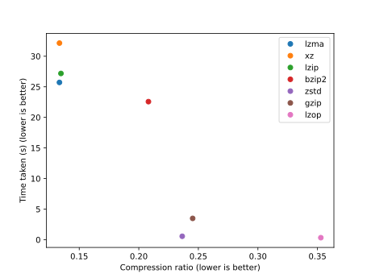

# Save files compression tests

Empirical evidence on the effectiveness of different compression algorithms over save files.

## Fallout: New Vegas

These tests were done using `tar [ALGORITHM]`, and thus use the default parameters.
Careful parameter tuning may allow to you obtain better results.
I intentionally wanted to compare the algorithms without any ad-hoc tuning.

These were the results on a save directory of about 100 MiB.

|Algorithm|Compression ratio|Time taken (s)|
|---------|-----------------|--------------|
|lzma     |13.339%          |25.718277     |
|xz       |13.341%          |32.148706     |
|lzip     |13.465%          |27.184341     |
|bzip2    |20.809%          |22.573468     |
|zstd     |23.646%          |0.561311      |
|gzip     |24.522%          |3.485473      |
|lzop     |35.281%          |0.32973       |

